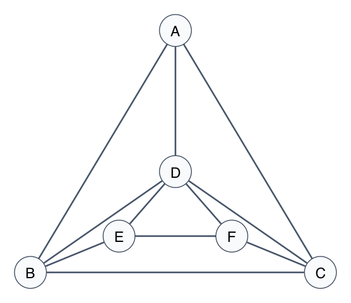
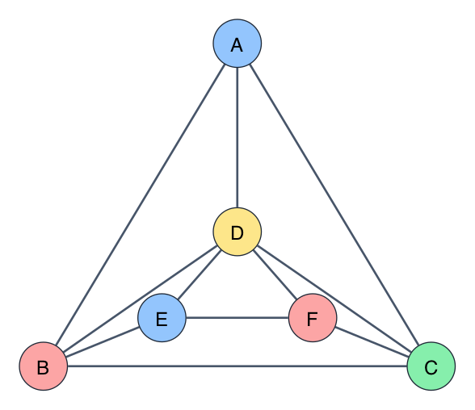

# Coloração de Grafos - Agendamento de Batch Jobs

Este problema pode ser representado por um grafo de conflitos entre rotinas noturnas de processamento em lote. Cada rotina é um vértice, e cada incompatibilidade é uma aresta.

As imagens dos grafos foram geradas com **Graphviz**, a partir dos arquivos `.dot` em `assets/`.

## A) Representação Computacional

Modelamos o problema como um grafo não direcionado:

$$
G = (V, E)
$$

O conjunto de vértices representa as rotinas:

$$
V = \{A, B, C, D, E, F\}
$$

O conjunto de arestas representa os conflitos:

$$
E = \{(A,B), (A,C), (A,D), (B,C), (B,D), (B,E), (C,D), (C,F), (D,E), (D,F), (E,F)\}
$$

Portanto:

$$
|V| = 6
$$

$$
|E| = 11
$$

Como o grafo é não direcionado, a aresta $(A,B)$ representa o mesmo conflito que $(B,A)$.

### Grafo de conflitos



## B) Matriz de Adjacência

Considerando a ordem dos vértices:

$$
A, B, C, D, E, F
$$

A matriz de adjacência é:

$$
\begin{array}{c|cccccc}
 & A & B & C & D & E & F \\
\hline
A & 0 & 1 & 1 & 1 & 0 & 0 \\
B & 1 & 0 & 1 & 1 & 1 & 0 \\
C & 1 & 1 & 0 & 1 & 0 & 1 \\
D & 1 & 1 & 1 & 0 & 1 & 1 \\
E & 0 & 1 & 0 & 1 & 0 & 1 \\
F & 0 & 0 & 1 & 1 & 1 & 0
\end{array}
$$

Listando os valores de cada linha:

```text
A: 0 1 1 1 0 0
B: 1 0 1 1 1 0
C: 1 1 0 1 0 1
D: 1 1 1 0 1 1
E: 0 1 0 1 0 1
F: 0 0 1 1 1 0
```

Na matriz, o valor $1$ indica que existe conflito entre duas rotinas. O valor $0$ indica que não existe conflito direto. A diagonal principal possui apenas zeros porque uma rotina não é incompatível consigo mesma.

## C) Planaridade e Fórmula de Euler

Um **grafo planar** é um grafo que pode ser desenhado no plano sem cruzamento entre suas arestas, exceto nos próprios vértices.

Para grafos planares conexos, vale a Fórmula de Euler:

$$
v - e + f = 2
$$

Onde:

$$
v = \text{número de vértices}
$$

$$
e = \text{número de arestas}
$$

$$
f = \text{número de faces}
$$

De acordo com o enunciado:

$$
v = 6
$$

$$
e = 11
$$

Substituindo na fórmula:

$$
6 - 11 + f = 2
$$

$$
-5 + f = 2
$$

$$
f = 7
$$

Portanto, quando desenhado no plano sem cruzamento de arestas, esse grafo divide o plano em:

$$
\boxed{7 \text{ faces}}
$$

Esse total inclui a face externa.

## D) Número Cromático $\chi(G)$

O número cromático do grafo é:

$$
\chi(G) = 4
$$

Isso ocorre porque as rotinas $A$, $B$, $C$ e $D$ formam um subgrafo completo $K_4$. Ou seja, todas são incompatíveis entre si:

$$
\{(A,B), (A,C), (A,D), (B,C), (B,D), (C,D)\}
$$

Como essas quatro rotinas possuem conflitos entre todas as combinações possíveis, elas precisam obrigatoriamente ser colocadas em quatro horários diferentes. Logo, o grafo precisa de pelo menos quatro cores.

Uma coloração válida com quatro cores é:

| Rotina | Cor | Horário |
|---|---|---|
| A | Azul | 1 |
| B | Vermelho | 2 |
| C | Verde | 3 |
| D | Amarelo | 4 |
| E | Azul | 1 |
| F | Vermelho | 2 |

### Grafo colorido



Essa coloração é válida porque:

- $E$ pode usar a mesma cor de $A$, pois não há conflito entre $A$ e $E$.
- $F$ pode usar a mesma cor de $B$, pois não há conflito entre $B$ e $F$.
- Nenhuma rotina ligada por uma aresta recebeu a mesma cor.

No contexto do sistema bancário, o número cromático representa a **quantidade mínima de janelas de execução** necessárias para executar todas as rotinas sem que duas rotinas incompatíveis rodem ao mesmo tempo.

Assim, a empresa precisa de no mínimo:

$$
\boxed{4 \text{ horários ou lotes de execução}}
$$

para processar todas as rotinas noturnas sem gerar conflitos de banco de dados.
